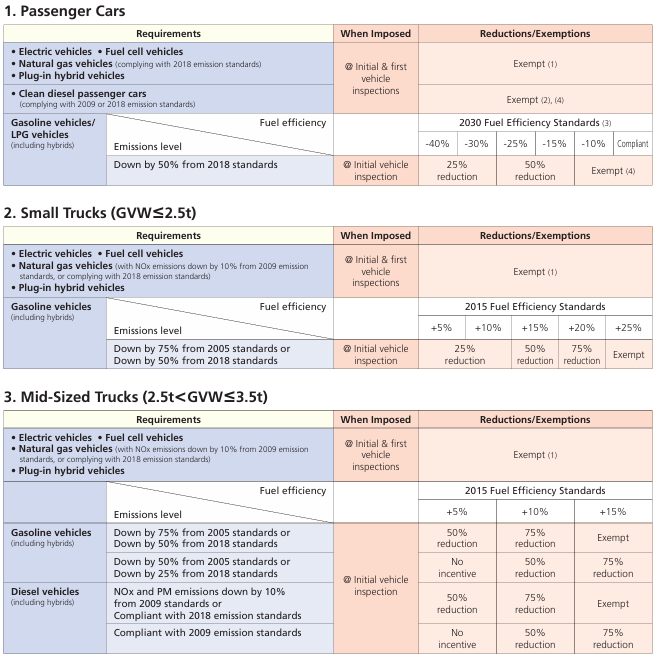
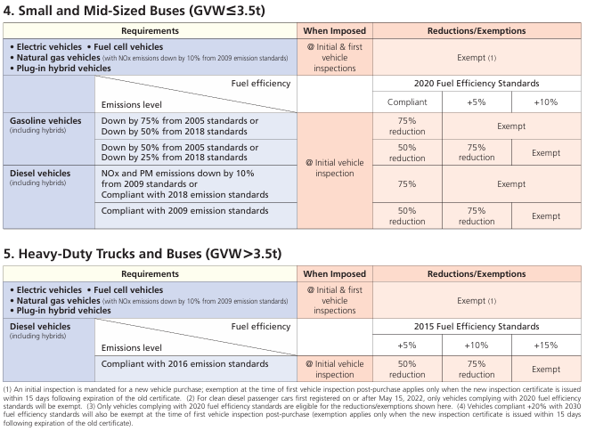
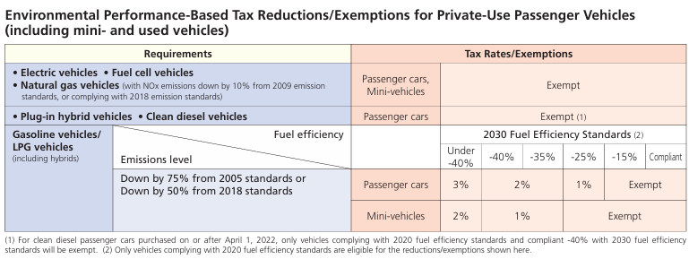
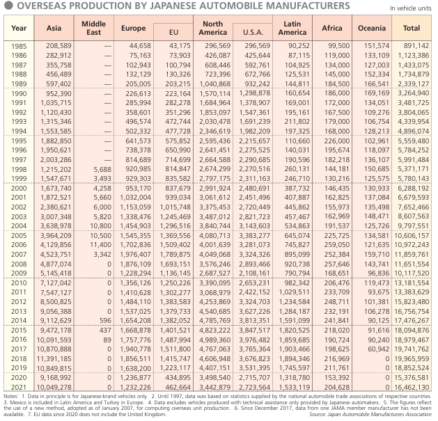
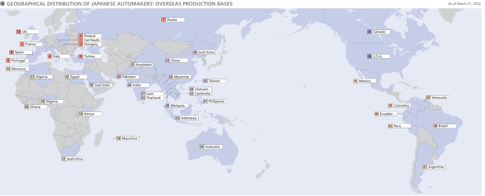
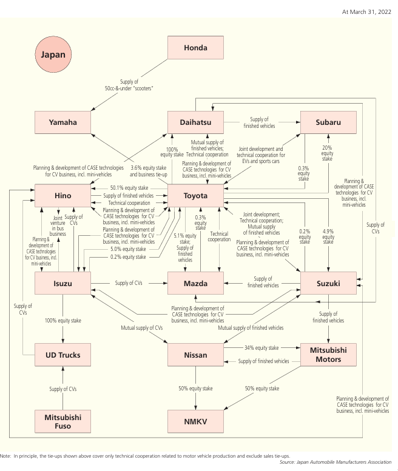
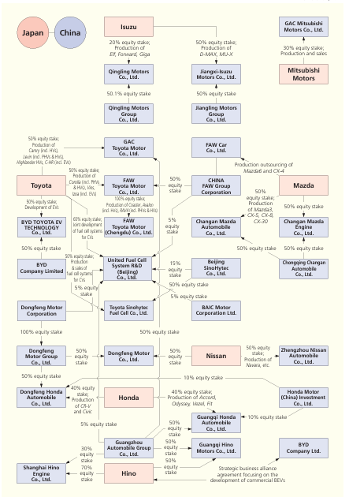

# Piyush Dwivedi ka kaaam

## Index:

### Motivation

### Method

### Data Analysis(Quantitative)

### Data Analysis(Qualitative)

#### EVs and Japan

#### Global Influence

### Conclusion

### References:

### Contributions:

## MOTIVATION:

The analysis of the automobile industry in Japan holds significant importance due to several compelling factors:

### Economic Powerhouse:

Japan's automobile industry stands as a cornerstone of the nation's economy, contributing substantially to employment, investment attraction, and GDP growth. Understanding the industry's current state and future trajectory is pivotal for policymakers, investors, and stakeholders to formulate informed strategies and drive sustained economic prosperity.

### Technological Vanguard:

Renowned for its innovation and engineering prowess, Japan spearheads technological advancements within the automotive sector. With ongoing developments in electric vehicles (EVs), autonomous driving technologies, and smart mobility solutions, comprehending Japan's role in shaping the future of automotive innovation is essential for industry stakeholders to remain competitive on a global scale.

### Market Dynamics:

Japan boasts a sophisticated consumer market characterized by discerning tastes and evolving preferences. Analyzing market trends, consumer behaviors, and competitive dynamics within Japan's automotive sector enables businesses to identify untapped opportunities, tailor product offerings, and devise effective market entry strategies.

### Regulatory Landscape:

Government policies and regulations play a pivotal role in shaping Japan's automotive industry. From emission standards to safety regulations and trade policies, understanding the regulatory environment is paramount for industry players to navigate compliance requirements, mitigate risks, and capitalize on emerging opportunities.

### Environmental Imperatives:

As sustainability gains prominence globally, Japan's automotive industry is increasingly focused on eco-friendly solutions and carbon footprint reduction. Analyzing Japan's initiatives towards promoting green mobility, including hybrid vehicles, fuel-efficient technologies, and renewable energy integration, provides valuable insights into the industry's efforts to align with environmental goals and consumer preferences.

### Global Competitiveness:

Japan's automotive manufacturers compete vigorously in both domestic and international markets, driving innovation and setting benchmarks for quality and reliability. Examining the competitive landscape, market positioning strategies, and technological capabilities of Japanese automakers enables businesses to benchmark performance, identify competitive advantages, and foster strategic collaborations for sustainable growth.

### Cultural Influence:

Japan's unique cultural values and societal trends influence consumer preferences and product adoption within the automotive industry. Understanding cultural nuances, brand perceptions, and lifestyle trends enriches market insights and facilitates the development of culturally resonant marketing strategies and product offerings.

### Supply Chain Dynamics:

Japan's automotive ecosystem encompasses a complex network of suppliers, manufacturers, and distributors. Analyzing supply chain dynamics, resilience strategies, and emerging trends such as Just-In-Time (JIT) manufacturing and Industry 4.0 integration enables businesses to optimize operations, mitigate disruptions, and enhance overall efficiency.

### Global Partnerships:

Collaboration and partnerships between Japanese automotive companies, technology firms, research institutions, and government agencies foster innovation and competitiveness on a global scale. Studying collaborative initiatives, joint ventures, and cross-industry alliances provides insights into emerging synergies, technology transfers, and market expansion strategies.

### Consumer-Centric Innovation:

Japan's automotive industry places a strong emphasis on consumer-centric innovation, leveraging cutting-edge technologies to enhance safety, comfort, and driving experience. Analyzing consumer insights, feedback mechanisms, and innovation pipelines enables businesses to anticipate market demands, address unmet needs, and deliver differentiated value propositions that resonate with target audiences.

In conclusion, the analysis of Japan's automobile industry offers a multifaceted perspective essential for stakeholders to navigate dynamic market forces, capitalize on emerging opportunities, and drive sustainable growth in the ever-evolving automotive landscape.

## EVs and Japan:

- Japan’s transition to electric vehicles (EVs) has just begun. In the near future, Japanese consumers and businesses will seek American EV products and solutions, presenting U.S. companies with increasing business opportunities in components, systems, software and aftermarket products.

- Japan’s passenger EV market set record sales in 2022. According to the Japan Automobile Dealers Association (JADA) and Japan Mini Vehicles Association (Zenkeijikyo), in 2022, 58,813 battery electric vehicles (BEVs) were sold in Japan, which was 2.7 times more than in 2021. The BEV ratio (BEVs share of passenger car sales) grew to 1.7% in 2022, surpassing 2021 (0.6%) and exceeding the 1% threshold for the first time. BEV sales in Japan are expected to further increase as Japan targets 100% environmentally friendly vehicles by 2035, and as consumers consider the environmental and economic benefits of EVs.

-The recent growth in BEV sales in Japan was led by a booming demand for Kei EVs. Kei cars translate as “light-weight automobiles” and are Japan’s smallest highway-legal passenger cars with restricted dimensions and engine capacity. Kei EV sales grew from 554 units in 2021 to 27,221 units in 2022 and accounted for 46.3% of total BEV sales. The best-selling Kei EV models were the Nissan Sakura and Mitsubishi eK X EV. Both cars received the “Japan Car of the Year” award; this marks the first time Kei EVs have been selected in the award’s 43-year history.

### Tax incentive Measures:

    To help expedite the shift to low-carbon road transport in the interest of curbing global warming and to help 
improve air quality, the Japanese government has, since April 2009, applied auto-related tax incentives to promote 
the wider use of eco-friendly vehicles.  Updated incentives and eligibility requirements came into effect in April and 
May 2021 and their effective periods were extended for two years.  Incentives for the acquisition tax expired at the 
end of September 2019 when the acquisition tax was abolished.

#### TONNAGE TAX REDUCTIONS/EXEMPTIONS:

  

  

#### Enviromental performance based Tax Reductions:

  

- From October 1, 2019, an automotive environmental performance-based tax came into effect as an adjunct provision to the automobile tax and the mini-vehicle tax. It is imposed at the time of vehicle (passenger car, mini-vehicle, heavy-duty vehicle, etc.) purchase and calculated on the basis of the vehicle’s environmental (i.e., fuel efficiency, emissions) performance and its purchase price.
- The tax applies to both new and used vehicles, with the exception of vehicles purchased for ¥500,000 or less, which are exempted from the tax.
- The fuel efficiency and other environmental performance criteria on the basis of which the tax’s varying rates (e.g., from 0% to 3% for passenger vehicles and from 0% to 2% for commercial vehicles and mini-vehicles) have been determined are in line with criteria established in Japan’s Energy Conservation Law. Highly fuel-efficient as well as electrified and other designated vehicles are exempted from the tax

#### Conclusion:

    In order to stimulate demand for EVs, the Japanese government continues to offer subsidies for purchases of new EVs with a revised budget of 70 billion Japanese Yen (approximately US$501 million) for fiscal year 2022. The subsidy amounts for new purchases are 650,000 Japanese Yen (US$4,656) for BEVs, 450,000 Japanese Yen (US$3,223) for Kei EVs and Plug-In Hybrid Electric Vehicles (PHEVs), and 2,300,000 Japanese Yen (US$16,474) for Fuel Cell Electric Vehicles (FCEVs). If a vehicle meets certain requirements, such as having a power supply function that can draw power from an onboard outlet (1500W/AC100V), or a capability of extracting power via an external power supply or V2H charger, the vehicle may qualify for a higher subsidy amount. In this case, the maximum subsidies are 850,000 Japanese Yen (US$6,089) for BEVs, 550,000 Japanese Yen (US$3,940) for Kei EVs and PHEVs, and 2,550,000 Japanese Yen (US$18,268) for FCEVs.

## GLOBAL INFLUENCE

### OVERSEAS PRODUCTION BY JAPANESE AUTOMOBILE MANUFACTURERS:

- The Japanese automobile manufacturers have been expanding their overseas production bases in order to reduce the impact of exchange rate fluctuations and to strengthen their global competitiveness.
- The overseas production volume of Japanese automobile manufacturers in 2019 was 19.5 million units, which was 1.3 times the domestic production volume of 9.5 million units.
- The global operations of Japanese automobile manufacturers continue to grow, focusing on on-site manufacturing
  to meet local needs. Whether as independent operations, joint ventures or technical tie-ups, local manufacturing
  activities are conducted in numerous countries around the world.

  

- The above table gives a big picture of the overseas production of Japanese automobile manufacturers.

### Geographical Distribution of Japanese Automakers’ Overseas Production Bases:

- Japanese automobile manufacturers have developed local production operations, whether as wholly-owned subsidiaries or as joint ventures, in the United States, Europe, Southeast Asia, China, Russia and other countries with emerging markets. These
  operations contribute to the strengthening of local economies through employment creation, local parts purchasing and, in many cases, export revenue for the host countries. Locally produced automobile parts such as engines and transmissions, as
  well as finished vehicles of some models, are exported to Japan and other destinations

  

#### The map provides insights into the global presence of Japanese automakers.

- Asia Dominance: A significant concentration of production bases is observed in Asia, particularly in China and Southeast Asian countries. This reflects strategic decisions to tap into these large markets.
- Europe and North America: Japanese automakers also have a strong foothold in Europe and North America. These regions are crucial for exports and catering to local demand.
- Strategic Factors: The distribution pattern may be influenced by factors such as market demand, labor costs, trade regulations, and supply chain efficiency.

##### Business Implications:

- Market Access: Having production bases in various regions ensures better access to local markets and reduces transportation costs.
- Risk Diversification: Diversification across continents mitigates risks related to geopolitical events, natural disasters, or economic downturns.
- Supply Chain Resilience: A well-distributed network enhances supply chain resilience, especially during disruptions (e.g., pandemic-related lockdowns).
- Competitive Advantage: Being close to key markets allows for quicker response to changing consumer preferences and regulatory requirements.

- In summary, this map reflects the strategic decisions of Japanese automakers in establishing production bases worldwide, balancing market access, risk management, and operational efficiency

### Japanese Automakers Forge Extensive International Alliances:

- With economic globalization, Japanese automobile manufacturers have rapidly adapted to the needs of individual
  markets, not only by shifting production to those markets but also by forging extensive alliances with overseas
  manufacturers.
- Various forms of partnership currently exist among Japanese, U.S. and European
  automakers—including capital and technical tie-ups, joint R&D and production operations, and cooperative sales
  ties—and such arrangements are expanding yearly. With the rapid growth of motorization in China and Southeast
  Asia, Japanese automakers have been actively building relationships with local manufacturers there on the basis of
  capital tie-ups and the supply of production as well as environment- and safety-related technologies.

  

#### This intricate network diagram represents the relationships and collaborations among various Japanese automotive companies. Let’s break down the key details:

##### Nodes and Connections:

- The central node labeled “Japan” represents the Japanese automotive industry as a whole.
- Nodes representing major automotive brands, including:
  Honda
  Yamaha
  Hino
  Isuzu
  UD Trucks
  Mitsubishi Fuso
  Toyota Group (including Daihatsu)
  Subaru
  Suzuki
  Nissan (including NMKV)
  Mitsubishi Motors

##### Toyota Group:

- Within the Toyota Group, there are internal connections with Daihatsu and other related entities.
  Additional Notes:
- The tie-ups shown in the diagram primarily cover technical cooperation related to vehicle production and exclude sales tie-ups.

#### Among these, tie-ups with Chinese automakers are particularly noteworthy:

- China is the world’s largest automobile market, and Japanese automakers have been actively forming alliances with local manufacturers to tap into this lucrative market.
- These partnerships involve technology transfer, joint ventures, and co-development of new models to cater to the specific needs of Chinese consumers.
- By leveraging the expertise of local partners, Japanese automakers can navigate regulatory challenges, localize production, and enhance brand visibility in China.

  

### Conclusion:

In conclusion, the meticulous scrutiny of Japan's automobile industry unravels a tapestry of unparalleled significance, depicting it as a bastion of innovation, technological acumen, and relentless market competitiveness. From pioneering advancements in electric vehicles to spearheading breakthroughs in autonomous driving technology, Japan stands at the vanguard of automotive evolution. Its cultural ethos, deeply intertwined with a commitment to quality and precision engineering, permeates every aspect of the industry, shaping consumer perceptions and market dynamics worldwide. As a global powerhouse driving the future of mobility, Japan's influence transcends borders, cementing its legacy as a trailblazer in the automotive realm, poised to navigate and redefine the ever-evolving landscape of transportation.

### References:

- https://www.jetro.go.jp/en/trends/industry/automobile/japan_auto_industry.html
- https://www.jama.or.jp/english/
- https://wikipedia.org
- AI tools like Microsoft Bing AI and CHatGPT
- https://google.com

### Contributions:

- Piyush Dwivedi: Wrote the entire analysis, conducted research, and compiled the information. (20%)
- Abhay Pratap Singh: Did Data Sampling, provided sampling technique, conducted quantitative data analysis, and descriptives statistics, did the same for a sample brand (Toyota). Also provided graphical analysis for all the statistics. (20%)
- Piyush Radheyshyam Panpaliya: Provided the required data and insights. (20%)
- Suyash Bilmore: Latex creation and final editing. (13.33%)
- Prabhat Kumar Sahu: Provided sources of data collection and Latex creation (13.33%)
- Sourav Mahil: Latex creation and final editing. (13.33%)
